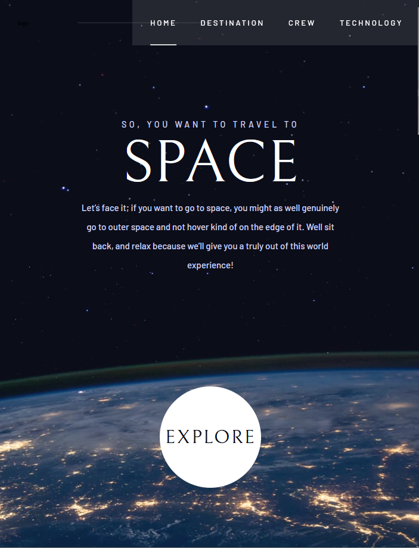

# Travel To Space!

This is a solution for [Space toursim multi-page website](https://www.frontendmentor.io/challenges/space-tourism-multipage-website-gRWj1URZ3) by Frontend Mentor

# 📝 Table of contents

-   [Live demo](#live-demo)
-   [Screenshot](#screenshot)
-   [Tech stack](#tech-stack)
-   [Author](#author)

# 🟢 Live demo [Travel To Space](https://euphonious-platypus-34f183.netlify.app/)

# 📷 Screenshot

## Built with

# 🔗 Author

